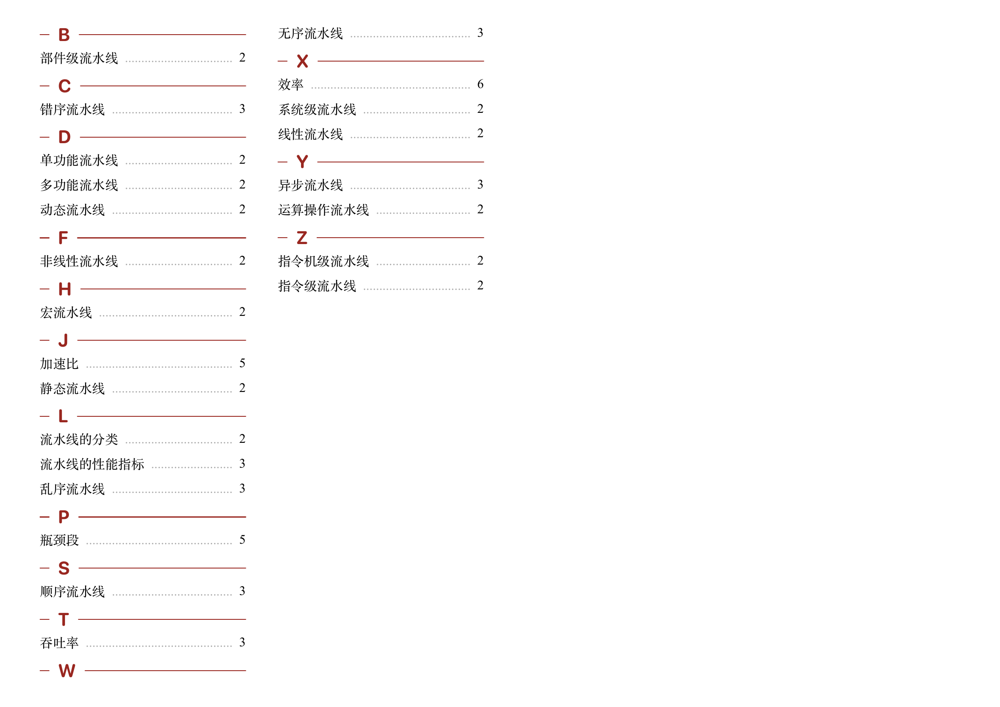

Ignite is a sophisticated index document generating tool, suitable for open-book exams, documentation, and similar scenarios.

Readme [中文](readme_zh.md) | English

## Prerequisites

- Python 3.4+ (with pip)
- Typst

## Usage

### Index File Syntax

Begin by writing the index content into `data/index.txt`. The index file consists of several lines. Except for blank lines (which will be ignored), each line should conform to one of two formats:

1. Starting with `<` and ending with `>`, this denotes a chapter division. The content inside the angle brackets will be considered the chapter title.
2. Composed of any content followed by a number at the end, representing an entry. The number indicates the page number of the entry.

### Generating the Document

```bash
python3 -m pip install -r requirements.txt
python3 main.py
typst compile index.typ
# This will generate index.pdf
```

For adjustments and formatting details, please review and modify `index.typ` as needed.

## Example

We have provided a set of examples under the `example/` directory. You can generate an example document with the following command:

```bash
typst compile index.typ --input data-dir=example
# This will generate index.pdf
```




